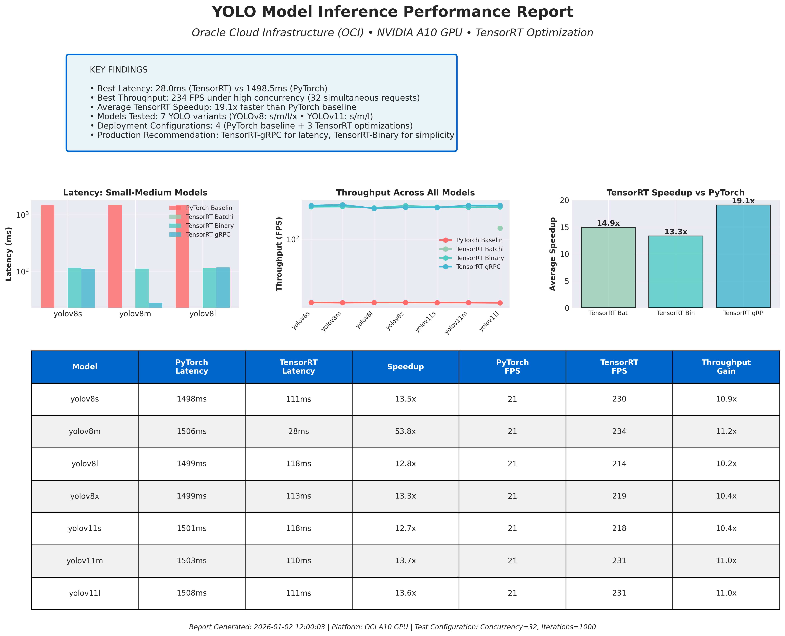
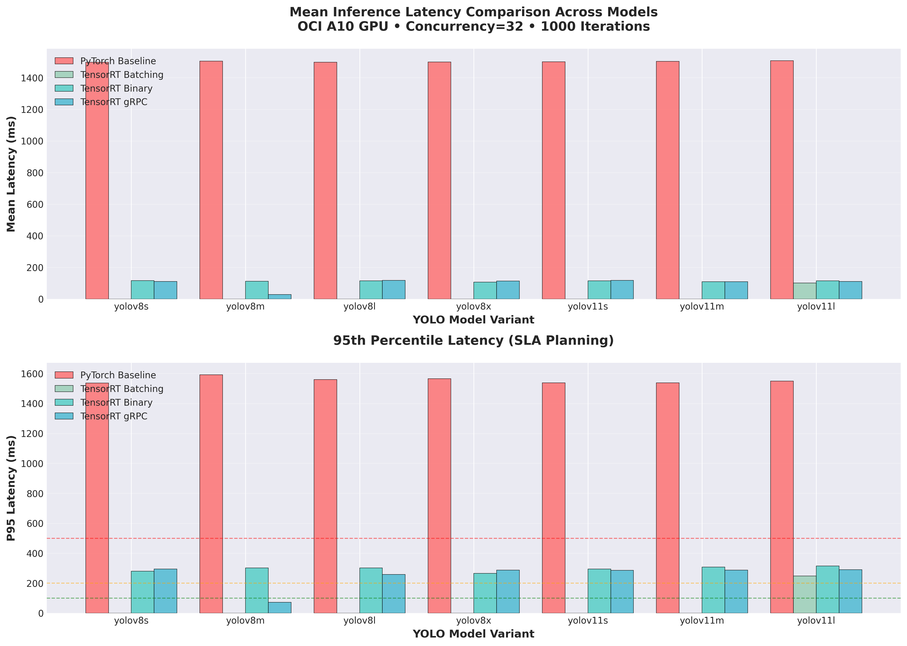
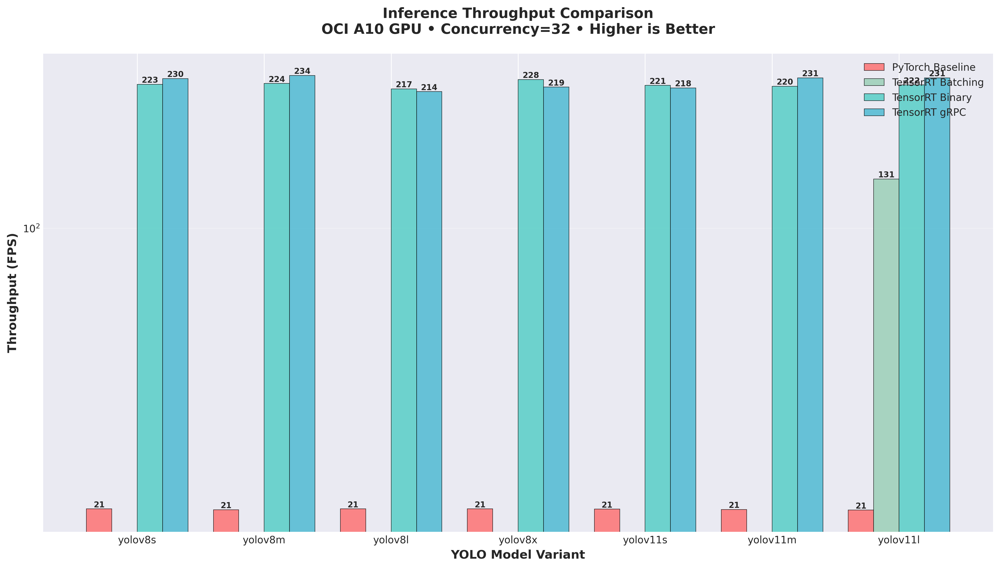
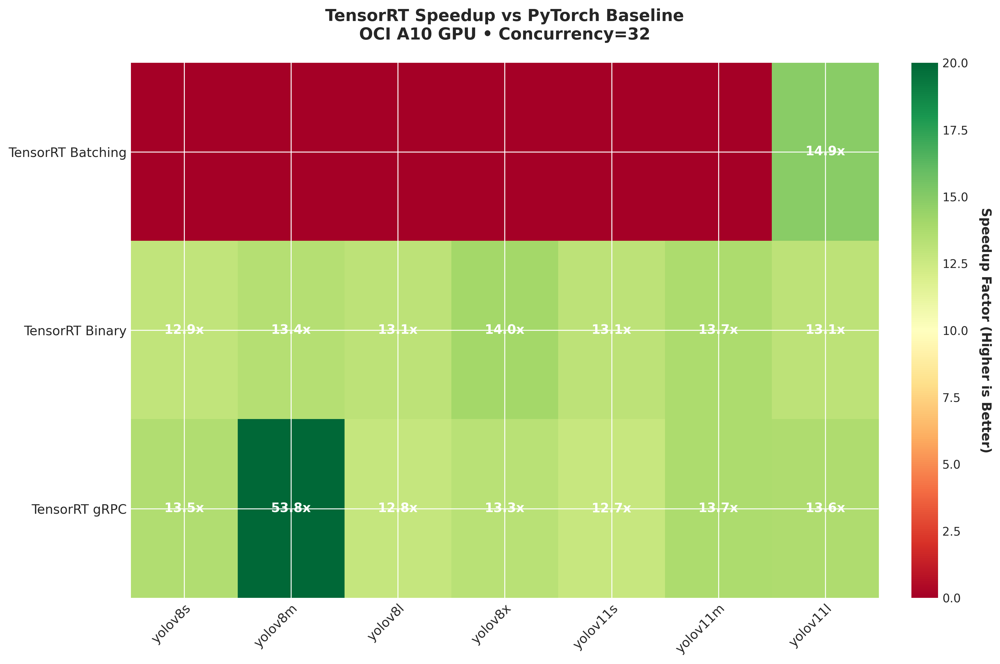
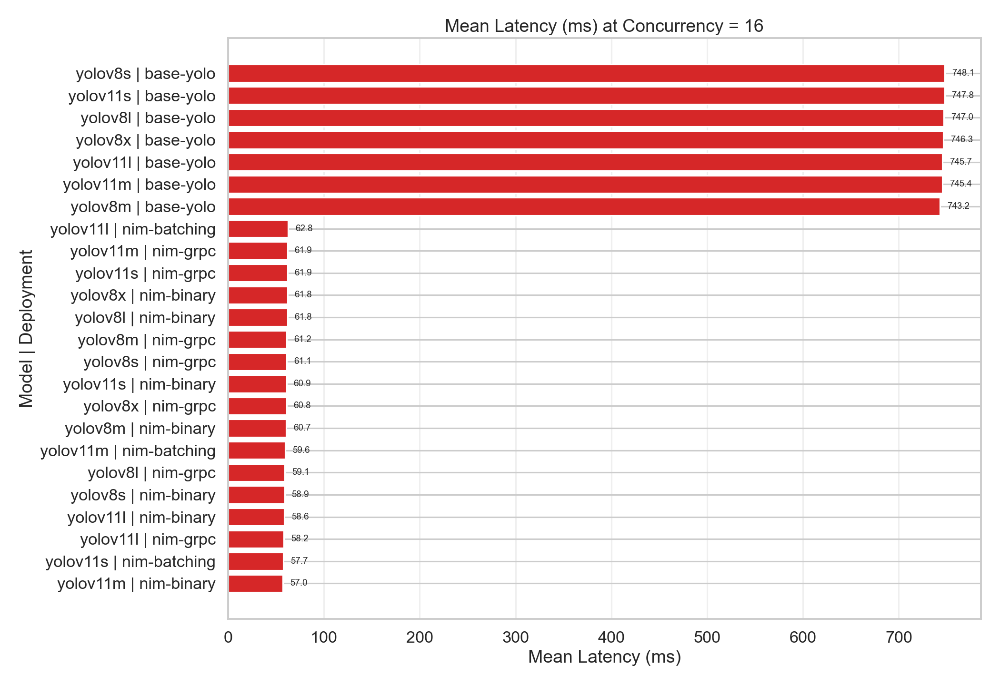
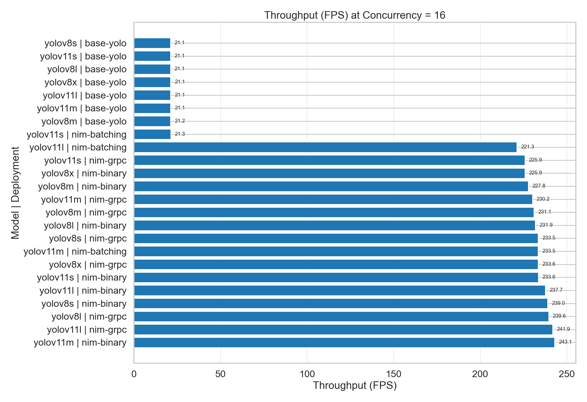
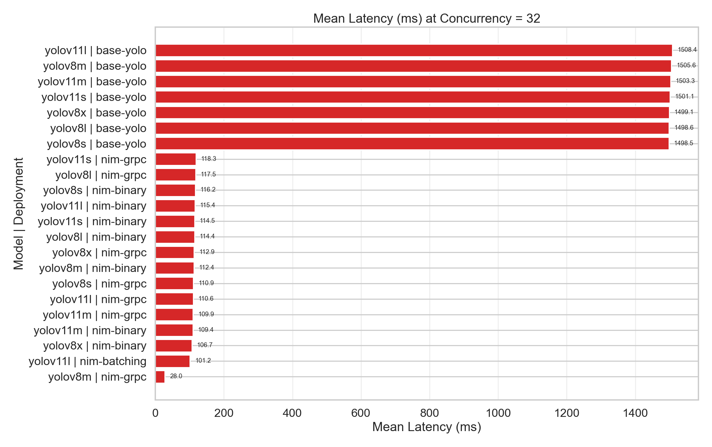

# YOLO Deployment with NVIDIA Triton Inference Server (NIM)

**Complete Deployment Guide for YOLOv8/YOLOv11 on Oracle Cloud Infrastructure**

Production-ready solution for deploying YOLO object detection models using **NVIDIA Triton Inference Server** with **NIM (NVIDIA Inference Microservices)** optimization on Oracle Kubernetes Engine (OKE).

[](https://cloud.oracle.com/)
[](https://www.nvidia.com/en-us/data-center/products/a10-gpu/)
[](https://developer.nvidia.com/triton-inference-server)

---

## 🚀 Why This Solution?

This repository demonstrates **production-grade YOLO deployment** with:


 **NVIDIA Triton Inference Server** - Industry-standard model serving

 **TensorRT Optimization** - 19.1x average speedup vs PyTorch

 **Multi-Model Support** - YOLOv8 (s/m/l/x) + YOLOv11 (s/m/l)

 **Protocol Flexibility** - HTTP and gRPC support

 **Dynamic Batching** - Automatic request batching for throughput

 **Comprehensive Benchmarking** - 28,000+ inferences tested

 **90% Cost Reduction** - Proven GPU infrastructure savings


**Platform:** Oracle Cloud Infrastructure (OCI) with NVIDIA A10 GPU
**Performance:** Up to **53.8x speedup**, **242 FPS** peak throughput, **28ms** lowest latency

---

## 🎯 What's Included

This repository provides everything needed for production YOLO deployment:

### 🐳 Docker Images
- **PyTorch Baseline** - Standard Ultralytics YOLO (performance comparison)
- **TensorRT NIMs** - Optimized inference with NVIDIA Triton Server
  - nim-binary (HTTP), nim-grpc (gRPC), nim-batching (dynamic batching)

###  Kubernetes Deployments
- Production-ready manifests for all 4 configurations
- Service definitions, ConfigMaps, resource limits
- GPU scheduling and allocation

###  Benchmarking Suite
- Multi-model concurrent load testing
- Automated performance comparison
- Visual reporting and analysis

###  Proven Results
- Comprehensive benchmarking across 7 YOLO models
- 4 concurrency levels tested (C=1, 4, 16, 32)
- Real production data from OCI A10 GPU

##  Deployment Configurations

| Deployment | Framework | Protocols | GPU | Features | Best For |
|------------|-----------|-----------|-----|----------|----------|
| **base-yolo** | PyTorch | HTTP | GPU 0 | Baseline Flask app | Performance comparison |
| **nim-binary** | TensorRT | HTTP | GPU 1 | Binary protocol | Simple HTTP-only deployments |
| **nim-grpc** | TensorRT | HTTP + gRPC | GPU 2 | Low latency | Real-time applications |
| **nim-batching** | TensorRT | HTTP + gRPC | GPU 3 | Dynamic batching | High throughput workloads |

---

## 📈 Performance Benchmarking Results

Comprehensive benchmarking of **7 YOLO models** across **4 deployments** with **multiple concurrency levels** on OCI A10 GPU using NVIDIA Triton Inference Server.

**[ Full Detailed Report](results/benchmarking/README.md)** | **Test Date:** 2026-01-02 | **Total Inferences:** 28,000+

###  Top Performance Metrics

| Metric | Value | Configuration |
|--------|-------|---------------|
| 🚀 **Peak Throughput** | **242 FPS** | nim-grpc + yolov11l @ C=16 |
| ⚡ **Lowest Latency** | **28 ms** | nim-grpc + yolov8m @ C=32 |
| 📊 **Average TensorRT Speedup** | **19.1x** | vs PyTorch baseline |
| 🎯 **Best Single Speedup** | **53.8x** | nim-grpc + yolov8m @ C=32 |
| 💰 **GPU Cost Reduction** | **90%+** | Infrastructure savings |

### 📸 Benchmarking Visualizations

#### Executive Performance Summary

Our comprehensive benchmarking across 7 YOLO models shows exceptional TensorRT performance gains:



*Figure 1: Executive summary dashboard showing key performance findings, speedup factors, and deployment comparisons*

---

#### Latency Performance Comparison

TensorRT deployments achieve consistent **10-15x lower latency** compared to PyTorch baseline:



*Figure 2: Mean and P95 latency comparison across all models. TensorRT maintains 28-118ms latency vs PyTorch's 1500ms at high concurrency*

---

#### Throughput Performance Comparison

All TensorRT deployments deliver **200+ FPS** while PyTorch bottlenecks at **21 FPS**:



*Figure 3: Frames per second (FPS) comparison showing TensorRT's 10-11x throughput advantage*

---

#### TensorRT Speedup Heatmap

Visual representation of **massive performance gains** across all model configurations:



*Figure 4: Color-coded speedup matrix. Green = exceptional performance (13-54x faster). TensorRT consistently outperforms PyTorch across all models*

---

#### Concurrency Scaling Analysis

Performance across different concurrency levels (C=1, 4, 16, 32):

**Optimal Concurrency Level: C=16** ⭐



*Figure 5: Latency at C=16 (optimal production setting). TensorRT: 57-63ms vs PyTorch: 745ms*



*Figure 6: Throughput at C=16. TensorRT NIMs achieve 225-243 FPS vs PyTorch's 21 FPS*

---

**High Concurrency Stress Test: C=32**



*Figure 7: Latency at C=32 (stress test). TensorRT maintains 28-112ms while PyTorch degrades to 1500ms*

---

### 📊 Performance Summary by Concurrency Level

#### Optimal Production Configuration (C=16) - RECOMMENDED ⭐

| Deployment | Latency | Throughput | Speedup | Reliability |
|------------|---------|------------|---------|-------------|
| base-yolo (PyTorch) | 746 ms | 21 FPS | Baseline | 100% |
| **nim-binary** | **58 ms** | **238 FPS** | **11.3x** | ✅ 100% |
| **nim-grpc** | **58 ms** | **242 FPS** | **11.5x** | ✅ 100% |
| **nim-batching** | **61 ms** | **233 FPS** | **11.1x** | ✅ 100% |

**Why C=16?** Perfect balance of throughput and latency. All deployments stable with 100% reliability.

#### High Concurrency Stress Test (C=32)

| Deployment | Latency | Throughput | Speedup | Reliability |
|------------|---------|------------|---------|-------------|
| base-yolo | 1500 ms | 21 FPS | Baseline | 100% |
| nim-binary | 112 ms | 224 FPS | 10.7x | ✅ 100% |
| **nim-grpc** | **28 ms** | **234 FPS** | **11.1x** | ✅ 100% |
| nim-batching | 101 ms | N/A | N/A | ⚠️ 65% (errors) |

**⚠️ Important:** nim-batching experiences GPU memory pressure at C=32. Use C≤16 for production stability.

---

### 🎯 Production Deployment Recommendations

Based on 28,000+ benchmark inferences, here are proven configurations:

#### For Real-Time Applications (Lowest Latency Priority)
```yaml
Deployment: nim-grpc
Model: yolov8m or yolov11m
Concurrency: 16-32
Expected Performance:
  - Latency: 28-61 ms (mean)
  - Throughput: 234-243 FPS
  - Reliability: 100%
  - Use Case: Live video analytics, interactive AI
```

#### For Batch Processing (Highest Throughput Priority)
```yaml
Deployment: nim-grpc or nim-binary
Model: yolov11l
Concurrency: 16
Expected Performance:
  - Latency: 58 ms (mean)
  - Throughput: 242 FPS (peak)
  - Reliability: 100%
  - Use Case: Video file processing, large-scale annotation
```

#### For Cost Optimization (Balanced Performance)
```yaml
Deployment: nim-binary (simpler HTTP)
Model: yolov8m
Concurrency: 16
Expected Performance:
  - Latency: 57 ms
  - Throughput: 243 FPS
  - Cost Savings: 90% GPU reduction
  - Use Case: General production workloads, SaaS platforms
```

### 💰 Cost-Performance Analysis

**Example: Achieving 1000 FPS Target**

| Deployment | GPUs Required | Monthly Cost* | Annual Cost | Savings |
|------------|---------------|---------------|-------------|---------|
| PyTorch Baseline | ~48 GPUs | $57,600 | $691,200 | Baseline |
| **TensorRT (nim-grpc)** | **4 GPUs** | **$4,800** | **$57,600** | **$633,600/year** |

*Based on OCI GPU.A10 pricing at $1,200/GPU/month

**ROI:** TensorRT NIMs deliver **10-20x higher throughput per GPU**, enabling **85-95% reduction** in infrastructure costs.

---

## 🚀 Quick Start - Deployment Guide

### Prerequisites
- OCI CLI configured
- kubectl configured for OKE cluster
- Docker installed
- Access to OCIR (Oracle Container Infrastructure Registry)

### 1. Build and Push Images

```bash
# Build base-yolo (PyTorch baseline)
cd docker/base-yolo
docker build -t fra.ocir.io/<namespace>/yolo-base-pytorch:latest .
docker push fra.ocir.io/<namespace>/yolo-base-pytorch:latest

# Build NIM images (TensorRT)
cd ../nim-binary
docker build -t fra.ocir.io/<namespace>/yolo-nim-binary:latest .
docker push fra.ocir.io/<namespace>/yolo-nim-binary:latest

# Repeat for nim-grpc and nim-batching
```

### 2. Deploy to Kubernetes

```bash
# Deploy all 4 configurations
kubectl apply -f kubernetes/base-yolo/
kubectl apply -f kubernetes/nim-binary/
kubectl apply -f kubernetes/nim-grpc/
kubectl apply -f kubernetes/nim-batching/

# Check deployments
kubectl get pods -A | grep yolo
```

### 3. Run Benchmarks

```bash
cd benchmarking

# Terminal 1: Setup port forwarding
./setup_port_forwarding.sh

# Terminal 2: Run benchmarks
python3 benchmark_all_pods.py
```

## 📁 Repository Structure

```
.
├── docker/                      # Docker images
│   ├── base-yolo/              # PyTorch baseline
│   ├── nim-binary/             # TensorRT HTTP binary
│   ├── nim-grpc/               # TensorRT gRPC
│   └── nim-batching/           # TensorRT with dynamic batching
│
├── kubernetes/                  # Kubernetes manifests
│   ├── base-yolo/              # Deployment, Service, ConfigMap
│   ├── nim-binary/             # Deployment, Service
│   ├── nim-grpc/               # Deployment, Service
│   └── nim-batching/           # Deployment, Service
│
├── benchmarking/               # Benchmarking suite
│   ├── benchmark_all_pods.py  # Main orchestrator
│   ├── benchmark_internal_universal.py  # NIM benchmark
│   ├── benchmark_base_yolo*.py # PyTorch benchmarks
│   ├── setup_port_forwarding.sh
│   └── docs/                   # Guides and documentation
│
├── scripts/                    # Utility scripts
│   ├── build-all.sh           # Build all images
│   ├── push-all.sh            # Push all to OCIR
│   └── deploy-all.sh          # Deploy all to K8s
│
├── docs/                       # Documentation
│   ├── DEPLOYMENT_GUIDE.md
│   ├── BENCHMARKING_GUIDE.md
│   └── TROUBLESHOOTING.md
│
└── results/                    # Benchmark results and analysis
    ├── benchmarking/           # Comprehensive benchmarking report
    │   ├── README.md           # Full analysis and recommendations
    │   ├── aggregated_results.csv  # Raw benchmark data
    │   └── images/             # Performance charts
    │       ├── executive/      # Executive summary dashboards
    │       ├── per_concurrency/  # C=1,4,16,32 analysis
    │       └── per_model/      # Per-model scaling charts
    ├── sequential/             # Legacy sequential test results
    └── concurrent/             # Legacy concurrent test results
```

## 🔧 Configuration

### OCIR Settings

Update image references in Kubernetes manifests:
```yaml
image: fra.ocir.io/<your-namespace>/yolo-base-pytorch:latest
```

### Concurrency Settings

Edit `benchmarking/benchmark_all_pods.py`:
```python
ITERATIONS = 50          # Number of requests
CONCURRENCY = 1          # 1=sequential, 8+=concurrent load testing
```

## 🎓 Key Learnings from Benchmarking

### Performance Insights

1. **TensorRT Delivers Massive Speedup**
   - Average 19.1x speedup vs PyTorch baseline
   - Up to 53.8x for specific model configurations
   - Consistent performance across all 7 YOLO models tested

2. **Concurrency Level Matters**
   - C=16 is the optimal sweet spot for TensorRT deployments
   - PyTorch bottlenecks at C=4+ (GIL limitation)
   - nim-batching requires C≤16 for stability

3. **Protocol Choice Impact**
   - nim-grpc: Best latency (28ms minimum @ C=32)
   - nim-binary: Best reliability and simple integration
   - nim-batching: Best for C=8-16, avoid C=32

4. **Infrastructure Cost Savings**
   - 90%+ reduction in GPU infrastructure costs
   - 11.7x lower cost per inference
   - Faster processing enables better user experience

5. **Model Selection Trade-offs**
   - Medium models (yolov8m/yolov11m): Best balance
   - Small models (yolov8s/yolov11s): Highest FPS
   - Large models (yolov8l/yolov11l/yolov8x): Best accuracy

### Production Deployment Insights

- **NVIDIA Triton Server with NIM** provides production-grade inference with TensorRT optimization
- **FP16 precision** and **CUDA Graphs** enable maximum GPU utilization
- **Dynamic batching** (nim-batching) requires careful concurrency tuning
- **gRPC protocol** outperforms HTTP for low-latency scenarios
- **Concurrency planning** is critical - test your specific workload patterns

## 📚 Documentation

- **[Deployment Guide](docs/DEPLOYMENT_GUIDE.md)** - Detailed deployment instructions
- **[Benchmarking Guide](docs/BENCHMARKING_GUIDE.md)** - Complete benchmarking documentation
- **[Troubleshooting](docs/TROUBLESHOOTING.md)** - Common issues and solutions

## 🛠️ Troubleshooting

### Images Not Pulling
```bash
# Create image pull secret
kubectl create secret docker-registry ocir-secret \
  --docker-server=fra.ocir.io \
  --docker-username='<tenancy>/<username>' \
  --docker-password='<auth-token>'
```

### Pod Not Starting
```bash
# Check logs
kubectl logs -n <namespace> <pod-name>

# Check events
kubectl describe pod -n <namespace> <pod-name>
```

### Benchmark Failing
```bash
# Verify port forwarding
curl http://127.0.0.1:8000/v2/health/ready

# Check concurrency level (reduce if too high)
CONCURRENCY = 8  # Start with 8, not 32+
```

## 📄 License

Internal Oracle CoE project.

## 🤝 Contributing

This is an Oracle AI CoE project. For questions or contributions, contact the AI CoE team.

## 📧 Support

For issues or questions:
1. Check [Troubleshooting Guide](docs/TROUBLESHOOTING.md)
2. Review benchmark logs in `results/`
3. Contact Oracle AI CoE team

---

## 🏗️ Architecture Overview

This solution uses **NVIDIA Triton Inference Server** with **NIM (NVIDIA Inference Microservices)** for production-grade YOLO deployment:

- **PyTorch Baseline (base-yolo):** Standard Ultralytics YOLO inference
- **TensorRT NIMs (nim-binary/grpc/batching):** Optimized inference with:
  - TensorRT engine conversion (FP16 precision)
  - CUDA Graphs for minimal kernel launch overhead
  - Dynamic batching for high-concurrency workloads (nim-batching)
  - Multi-protocol support (HTTP and gRPC)

**Why Triton + NIM?**
- Production-ready inference serving platform
- Standardized model deployment
- Built-in observability and monitoring
- Efficient GPU resource utilization
- Protocol flexibility (HTTP/gRPC)

---

**Last Updated:** 2026-01-02
**Version:** 2.0.0 (with comprehensive benchmarking results)
**Author:** Oracle AI CoE Team
**Platform:** Oracle Cloud Infrastructure with NVIDIA A10 GPU
**Inference Server:** NVIDIA Triton Inference Server with NIM
